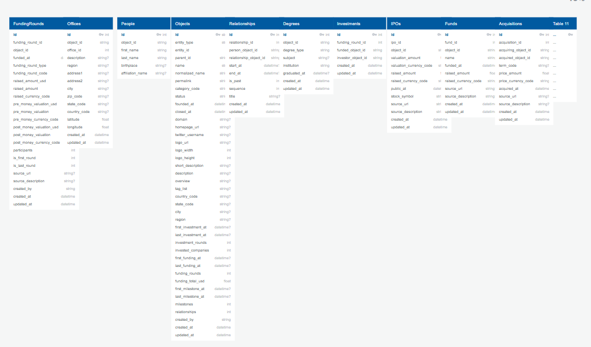
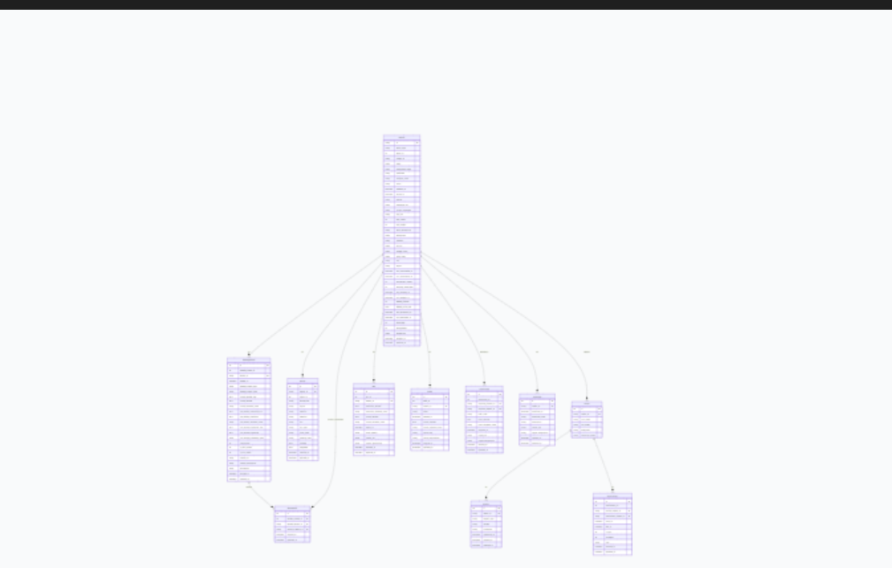
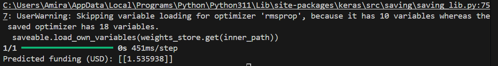
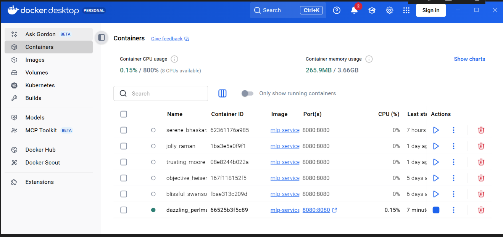
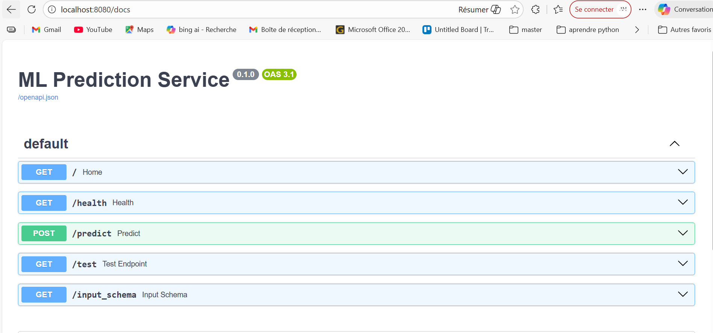
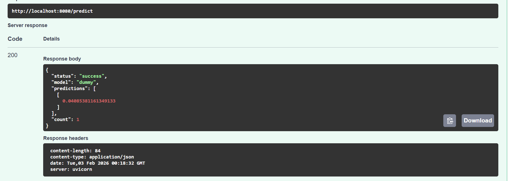
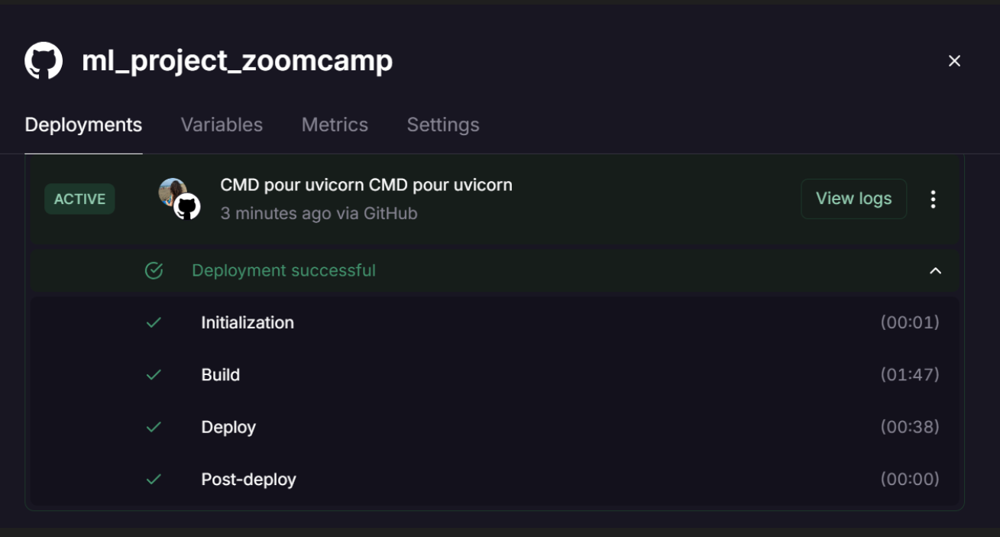

# Startup Investments Prediction
 


This project uses a Startup Investments dataset from Kaggle.
The goal is to predict total funding  `(funding_total_usd)`  for startups using machine learning.
## The dataset contains information such as:


company funding

number of investors

number of offices

IPO status

acquisitions

company milestones

relationships with other companies

The goal is to analyze startups and predict their success.



## Project Goal

The main objective of this project is to analyze startups and predict their total funding `(funding_total_usd)` based on company features and historical data.

## Target Variable

`funding_total_usd`: The total amount of funding a startup has received (in USD).
Our machine learning models are trained to predict this value using the selected features.
Models

`Linear Regression`, `Ridge`, `Lasso`, `Random Forest` – `classical ML models`

`MLP (Deep Learning)` – neural network model

## Preprocessing

Fill missing numeric values with 0

Fill missing categorical values with `Unknown`

Encode categorical columns

Scale numeric features

## Results

The models predict total funding `(funding_total_usd)`  

Performance is measured with RMSE and R² score

Saved Files

 `mlp_funding_model.h5 `  – full deep learning model

`mlp_model_architecture.json` – model architecture

`mlp_model.weights.h5` – model weights

`mlp_model_pickle.pkl` – pickle file for saving model paths
## Selected Features

For the machine learning models, these features are used:

* **nb_funding_rounds** – number of funding rounds
* **nb_investors** – number of investors
* **nb_offices** – number of company offices
* **ipo** – if the company went public (IPO)
* **acquired** – if the company was acquired
* **milestones** – important events in the company history
* **relationships** – business relationships
* **funding_rounds** – funding information


## Usage / How to run prediction

To predict funding for a new startup, run the file:

```bash
 python predict.py
```
 output after running predict.py:

```bash
 1/1 ━━━━━━━━━━━━━━━━━━━━ 0s 451ms/step
Predicted funding (USD): [[1.535938]]
```



## ML Prediction Service

The service is in the service folder. It uses FastAPI to predict startup funding.


* Build Docker image
```bash
cd service
docker build -t mlp-service:v1 . 
```

* Run Docker container

```bash
docker run -p 8080:8080 mlp-service:v1 
```




* Open your browser and check:


```bash
 Home: http://localhost:8080
```



```bash
 Health check: http://localhost:8080/health
```


```bash
 API docs (Swagger UI): http://localhost:8080/docs

```
* Test prediction

Send a POST request to /predict with JSON input:

```bash
 [
  {
    "nb_funding_rounds": 3,
    "nb_investors": 10,
    "nb_offices": 2,
    "ipo": 0,
    "acquired": 0,
    "milestones": 5,
    "relationships": 7,
    "funding_rounds": 3
  }
]
```


## Cloud Deployment on Railway

`Source Repo:` 
 ```bash
  GitHub repository ARMOD07/ml_project_zoomcamp

```

`Root directory:` service → FastAPI code (app.py) is here.

`Branch:` main → Changes in this branch are deployed automatically.

Networking

Public network → Service is available on the internet.

` endpoint: `
 ```bash
https://mlzoomcamp.railway.app
```

Healthcheck endpoint: /health → Railway checks if the service is live.

Scale & Resources

`Replicas:`  1 (one running copy)

`CPU:` 2 vCPU, Memory: 1 GB (limit on free plan)

Multi-region requires Pro plan.

Build & Start

`Build command:`
```bash
uses Python 3.11.6
``` 

`Start command:`

 ```bash
python app.py --port 9000
``` 
 
  
  
 
# Hugging Face 🚀


You can try it live on Hugging Face Spaces:  
[**Open the app here**](https://huggingface.co/spaces/mira73/mlstartup)

## Environment Variables

To run this project, you will need to add the following environment variables to your .env file

`API_KEY`

`ANOTHER_API_KEY`


## Notes

This project uses the Startup Investments dataset to analyze startups.

You can run the ML model locally using predict.py or with Docker.

The service is available on Railway cloud with /health check and /docs Swagger UI.

All features are saved in feature_cols.json.

The model predicts the total funding of startups.

For more details, check app.py, mlp_model_* files, and predict.py.


## Used By
This project was created by Amira Mohammedi for the ML Project Zoomcamp


## 🛠 Skills
 

This project uses the following tools:

- [](https://www.python.org/)  
 
 **Pandas**
 **NumPy**
 **Scikit-learn**
 **TensorFlow / Keras**
 **FastAPI**
 

